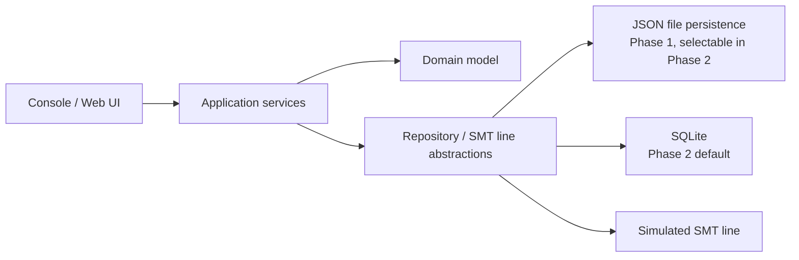

# Architecture

This document describes the solution strategy and the main building blocks of the application. The system context and scope are described in [requirements.md](requirements.md#system-scope), the business concepts in the [domain model](domain-model.md).

## Solution strategy

The solution separates domain and application logic from infrastructure concerns. Storage technology and the connection to the production line are hidden behind abstractions, so they can be replaced without changing the domain model or the application logic.

The domain is modelled with domain-driven design (DDD), as described in the [domain model](domain-model.md). The domain model has no dependencies on infrastructure; the application services coordinate the aggregates and enforce rules that span several aggregates.

## Building blocks

| Building block | Responsibility |
|---|---|
| Console / Web UI | User interaction. A console application in Phase 1; an ASP.NET Core Web API with a web UI in Phase 2. |
| Application services | Use cases: create, edit, search and remove orders, boards and components, and download an order. Enforce rules that span aggregates, such as restricted deletion. |
| Domain model | The `Order`, `Board` and `Component` aggregates, their value objects, the total component demand domain service and the business rules, as described in the [domain model](domain-model.md). |
| Repository / SMT line abstractions | One repository interface per aggregate root, and an interface for handing an order over to a production line. |
| JSON file persistence | Repository implementation storing data as JSON files via `System.Text.Json`. |
| SQLite | Repository implementation backed by SQLite. |
| Simulated SMT line | Receives the order-download payload in place of a real production line. |

## Persistence evolution

Phase 1 uses lightweight JSON-file repositories. Phase 2 adds SQLite repositories behind the same persistence interfaces and makes them the default; the active implementation is chosen via configuration.