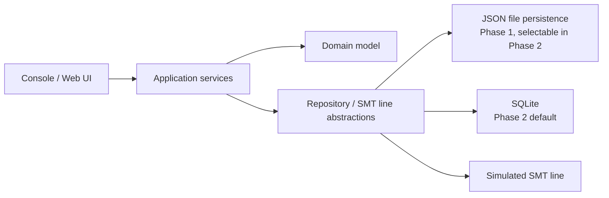
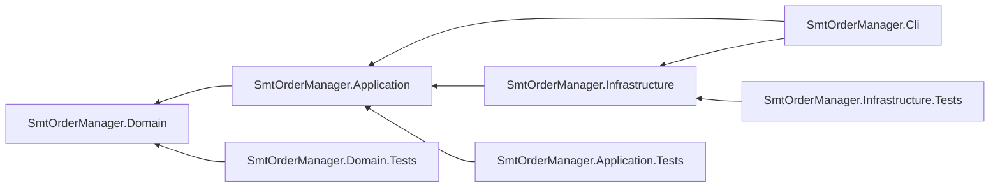
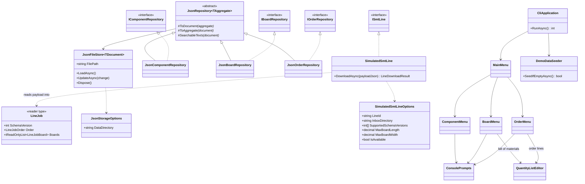

# Architecture

This document describes the solution strategy and the main building blocks of the application. The system context, product context and quality goals are described in [requirements.md](requirements.md), the business concepts in the [domain model](domain-model.md).

## Solution strategy

The solution follows Clean Architecture and separates domain and application logic from infrastructure concerns. Storage technology and the connection to the production line are hidden behind abstractions, so they can be replaced without changing the domain model or the application logic.

The domain is modelled with domain-driven design (DDD), as described in the [domain model](domain-model.md). The domain model has no dependencies on infrastructure; the application services coordinate the aggregates and enforce rules that span several aggregates.

## Building blocks

| Building block | Project | Responsibility |
|---|---|---|
| Console / Web UI | `SmtOrderManager.Cli` (Phase 2: an additional Web API project) | User interaction and composition root: wires the application services to the infrastructure implementations. |
| Application services | `SmtOrderManager.Application` | Use cases: create, edit, search and remove orders, boards and components, and download an order. Enforce rules that span aggregates, such as restricted deletion. Own the download contract: map the domain model to the download payload and serialize it to JSON. |
| Domain model | `SmtOrderManager.Domain` | The `Order`, `Board` and `Component` aggregates, their value objects, the total component demand domain service and the business rules, as described in the [domain model](domain-model.md). |
| Repository / SMT line abstractions | `SmtOrderManager.Application` | One repository interface per aggregate root, and the `ISmtLine` port for handing a serialized order over to a production line. |
| JSON file persistence | `SmtOrderManager.Infrastructure` | Repository implementation storing data as JSON files via `System.Text.Json`. |
| SQLite | `SmtOrderManager.Infrastructure` | Repository implementation backed by SQLite. |
| Simulated SMT line | `SmtOrderManager.Infrastructure` | Stand-in for a real production line. Acts as an independent consumer of the download contract, see [Simulated SMT line](#simulated-smt-line). |

## Project dependencies

Project references point inward only, so the dependency rule of Clean Architecture is enforced by the compiler:

The domain project references nothing. Application references only the domain. Infrastructure implements the abstractions defined in Application. The CLI is the only project that knows both sides and connects them.

Each production project except the CLI has its own test project, so tests follow the same dependency rule as the code they cover:

| Test project | Covers |
|---|---|
| `SmtOrderManager.Domain.Tests` | Aggregates, value objects and the total component demand domain service |
| `SmtOrderManager.Application.Tests` | Use cases against in-memory repository fakes and a fake SMT line, the payload mapping and the contract test of the download payload |
| `SmtOrderManager.Infrastructure.Tests` | JSON file persistence round trips, the rules of the simulated SMT line, checked against the approved example of the download payload, and the service registrations used by the CLI composition root |

## Class outline

The diagrams below show the main classes of each layer as implemented, with their public operations. Constructors, private members and the read models returned by the use cases (`ComponentDetails`, `BoardDetails`, `OrderDetails`) are left out for readability. Generic types are written with `~T~`.

### Domain

`Create` generates a new identifier, `Restore` rebuilds a persisted aggregate with its existing one. Both apply the same rules, so invalid stored data is detected when it is loaded. A broken rule throws `DomainException`.

### Application

Each create, update and remove operation takes a batch and either applies all of it or returns the violations of every item. `OrderDownloadService` also reads boards and components and uses `ComponentDemandCalculator`; those dependencies are left out of the diagram.

### Infrastructure and console application

`JsonRepository` also takes the document type as a second type parameter; each repository maps its aggregate to its own document record (`ComponentDocument`, `BoardDocument`, `OrderDocument`). The menus call the application services shown above; `Program` registers everything through `AddApplication`, `AddInfrastructure` and `AddCli`.

## Integration contract

The order download is the application's interface to the rest of the production flow. The receiving side is developed and released independently, so the contract is designed for evolution:

- The payload is a dedicated data transfer object, mapped from the domain model in the application layer. The domain model itself is never serialized across this boundary.
- The application layer also serializes the payload to JSON. The contract consists of the DTOs and their JSON representation, so both are owned in the same place. `System.Text.Json` is part of the .NET base class library, so this adds no infrastructure dependency to the application layer.
- The `ISmtLine` port receives the serialized JSON, not the DTO instance. A line implementation therefore depends only on the JSON format, exactly as a separately developed line would.
- The payload carries a schema version. Within a version, changes are additive only; breaking changes introduce a new version.
- Consumers follow the tolerant reader principle and ignore fields they do not know.
- Contract tests compare the serialized payload against an approved example, so an unintended format change fails the build instead of reaching the line. The approved example also serves as the documented reference of the format. The fields, formats and consumer expectations are described in the [download contract](download-contract.md).

The port distinguishes two kinds of outcome:

- **Rejection** is a normal business outcome. The line received the payload but refuses the job, for example because of an unsupported schema version or a board that does not fit. The port returns a result that states whether the job was accepted, the line's identifier, the time of receipt and the reasons for a rejection.
- **Failure** is a technical problem. The line cannot be reached at all. The port signals this with a dedicated exception defined in the application layer.

The download use case logs both. Only an accepted download marks the order as downloaded; after a rejection or a failure the order stays a draft and can be corrected and downloaded again.

## Simulated SMT line

The simulated line replaces a real production line. It stays a stand-in for the line's handover interface and deliberately does not simulate production: it does not count produced boards or model progress, because production execution is outside the [system scope](requirements.md#system-scope).

It behaves like an independent consumer of the download contract:

- **Own reader types.** It parses the JSON with its own internal types instead of reusing the application's DTOs, so the tolerant reader principle is exercised in running code: a payload with an additional unknown field is still accepted.
- **Schema version check.** It supports a configurable set of schema versions and rejects any other version with a clear reason instead of interpreting the payload partially.
- **Board dimension limit.** A real line can only handle boards up to the size its conveyor and machines support. The simulated line has a configurable maximum board length and width and rejects jobs containing boards that exceed them, listing each affected board with its actual and permitted size. Boards are not rotated to fit. The limits are configuration values and do not describe any specific machine.
- **Inbox.** Each accepted job is written as a JSON file to a configurable inbox directory, named after the order and the time of receipt, so repeated downloads of the same order do not overwrite each other. This mirrors lines that receive their jobs as files and makes the handover visible.
- **Unavailable mode (optional).** A configuration switch makes the line unreachable, so the handling and logging of technical failures can be demonstrated.

## Persistence evolution

Phase 1 uses lightweight JSON-file repositories. Phase 2 adds SQLite repositories behind the same persistence interfaces and makes them the default; the active implementation is chosen via configuration.

Persistence uses its own document types, mapped to and from the aggregates in the infrastructure layer. The aggregates provide a factory method for creating new instances and a separate one for restoring persisted instances with their existing identifiers, so the domain model needs no serialization attributes.