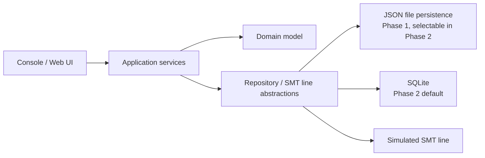
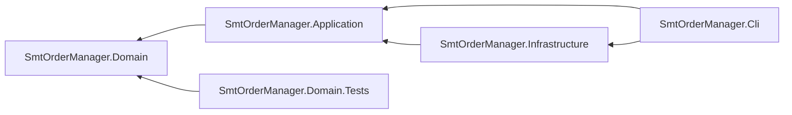

# Architecture

This document describes the solution strategy and the main building blocks of the application. The system context, product context and quality goals are described in [requirements.md](requirements.md), the business concepts in the [domain model](domain-model.md).

## Solution strategy

The solution follows Clean Architecture and separates domain and application logic from infrastructure concerns. Storage technology and the connection to the production line are hidden behind abstractions, so they can be replaced without changing the domain model or the application logic.

The domain is modelled with domain-driven design (DDD), as described in the [domain model](domain-model.md). The domain model has no dependencies on infrastructure; the application services coordinate the aggregates and enforce rules that span several aggregates.

## Building blocks

| Building block | Project | Responsibility |
|---|---|---|
| Console / Web UI | `SmtOrderManager.Cli` (Phase 2: an additional Web API project) | User interaction and composition root: wires the application services to the infrastructure implementations. |
| Application services | `SmtOrderManager.Application` | Use cases: create, edit, search and remove orders, boards and components, and download an order. Enforce rules that span aggregates, such as restricted deletion. |
| Domain model | `SmtOrderManager.Domain` | The `Order`, `Board` and `Component` aggregates, their value objects, the total component demand domain service and the business rules, as described in the [domain model](domain-model.md). |
| Repository / SMT line abstractions | `SmtOrderManager.Application` | One repository interface per aggregate root, and an interface for handing an order over to a production line. |
| JSON file persistence | `SmtOrderManager.Infrastructure` | Repository implementation storing data as JSON files via `System.Text.Json`. |
| SQLite | `SmtOrderManager.Infrastructure` | Repository implementation backed by SQLite. |
| Simulated SMT line | `SmtOrderManager.Infrastructure` | Receives the download payload in place of a real production line. |

## Project dependencies

Project references point inward only, so the dependency rule of Clean Architecture is enforced by the compiler:

The domain project references nothing. Application references only the domain. Infrastructure implements the abstractions defined in Application. The CLI is the only project that knows both sides and connects them.

## Integration contract

The order download is the application's interface to the rest of the production flow. The receiving side is developed and released independently, so the contract is designed for evolution:

- The payload is a dedicated data transfer object, mapped from the domain model in the application layer. Infrastructure serializes it to JSON and delivers it to the line. The domain model itself is never serialized across this boundary.
- The payload carries a schema version. Within a version, changes are additive only; breaking changes introduce a new version.
- Consumers follow the tolerant reader principle and ignore fields they do not know.
- Contract tests compare the serialized payload against an approved example, so an unintended format change fails the build instead of reaching the line.

## Persistence evolution

Phase 1 uses lightweight JSON-file repositories. Phase 2 adds SQLite repositories behind the same persistence interfaces and makes them the default; the active implementation is chosen via configuration.