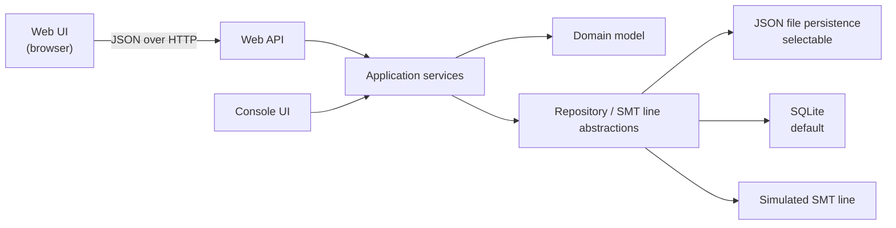
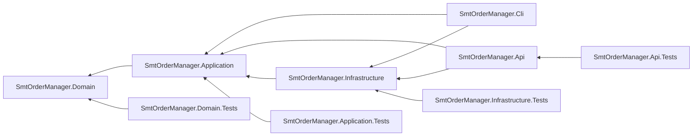
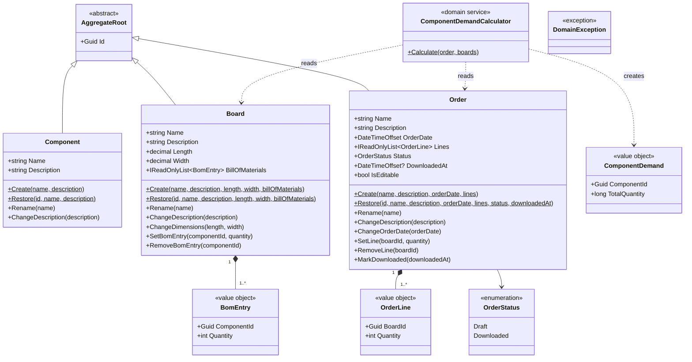
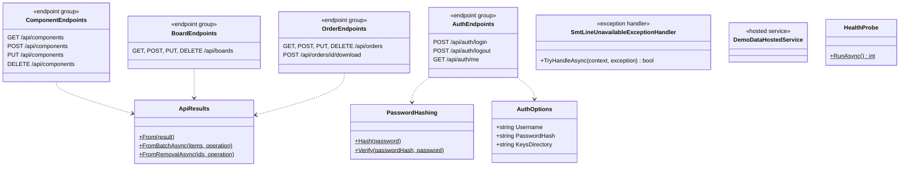

# Architecture

This document describes the solution strategy and the main building blocks of the application. The system context, product context and quality goals are described in [requirements.md](requirements.md), the business concepts in the [domain model](domain-model.md).

## Solution strategy

The solution follows Clean Architecture and separates domain and application logic from infrastructure concerns. Storage technology and the connection to the production line are hidden behind abstractions, so they can be replaced without changing the domain model or the application logic.

The domain is modelled with domain-driven design (DDD), as described in the [domain model](domain-model.md). The domain model has no dependencies on infrastructure; the application services coordinate the aggregates and enforce rules that span several aggregates.

## Building blocks

| Building block | Project | Responsibility |
|---|---|---|
| Console UI | `SmtOrderManager.Cli` | User interaction in a terminal, and composition root of the console host: wires the application services to the infrastructure implementations. |
| Web API | `SmtOrderManager.Api` | HTTP endpoints for the use cases, cookie login, and the static files of the web UI. Composition root of the web host. See [Web API](#web-api). |
| Web UI | `SmtOrderManager.Web` | React single-page application in the browser. Collects input, calls the Web API and shows its answers; it holds no business rules. Built into the API's `wwwroot`. |
| Application services | `SmtOrderManager.Application` | Use cases: create, edit, search and remove orders, boards and components, and download an order. Enforce rules that span aggregates, such as restricted deletion. Own the download contract: map the domain model to the download payload and serialize it to JSON. Create the demo data for both hosts. |
| Domain model | `SmtOrderManager.Domain` | The `Order`, `Board` and `Component` aggregates, their value objects, the total component demand domain service and the business rules, as described in the [domain model](domain-model.md). |
| Repository / SMT line abstractions | `SmtOrderManager.Application` | One repository interface per aggregate root, and the `ISmtLine` port for handing a serialized order over to a production line. |
| JSON file persistence | `SmtOrderManager.Infrastructure` | Repository implementation storing data as JSON files via `System.Text.Json`. |
| SQLite | `SmtOrderManager.Infrastructure` | Repository implementation backed by SQLite through Entity Framework Core. See [Persistence](#persistence). |
| Simulated SMT line | `SmtOrderManager.Infrastructure` | Stand-in for a real production line. Acts as an independent consumer of the download contract, see [Simulated SMT line](#simulated-smt-line). |

## Project dependencies

Project references point inward only, so the dependency rule of Clean Architecture is enforced by the compiler:

The domain project references nothing. Application references only the domain. Infrastructure implements the abstractions defined in Application. The two hosts, the CLI and the Web API, are the only projects that know both sides and connect them. They share every registration through `AddApplication` and `AddInfrastructure` and add only their own user interface. The web UI is not a .NET project; it talks to the Web API over HTTP only.

Each .NET production project except the CLI has its own test project, so tests follow the same dependency rule as the code they cover:

| Test project | Covers |
|---|---|
| `SmtOrderManager.Domain.Tests` | Aggregates, value objects and the total component demand domain service |
| `SmtOrderManager.Application.Tests` | Use cases against in-memory repository fakes and a fake SMT line, the payload mapping and the contract test of the download payload |
| `SmtOrderManager.Infrastructure.Tests` | The repository contract, run against both SQLite and JSON files, provider-specific persistence behaviour, the rules of the simulated SMT line, checked against the approved example of the download payload, and the service registrations shared by both hosts |
| `SmtOrderManager.Api.Tests` | The real web host in memory: HTTP status codes and error mapping, login and the protection of the API |

## Class outline

The diagrams below show the main classes of each layer as implemented, with their public operations. Constructors, private members and the read models returned by the use cases (`ComponentDetails`, `BoardDetails`, `OrderDetails`) are left out for readability. Generic types are written with `~T~`.

### Domain

`Create` generates a new identifier, `Restore` rebuilds a persisted aggregate with its existing one. Both apply the same rules, so invalid stored data is detected when it is loaded. A broken rule throws `DomainException`.

### Application

```mermaid
classDiagram
    direction TB

    class ComponentService {
        +CreateAsync(commands) OperationResult
        +UpdateAsync(commands) OperationResult
        +SearchAsync(text) IReadOnlyList~ComponentDetails~
        +RemoveAsync(ids) OperationResult
    }
    class BoardService {
        +CreateAsync(commands) OperationResult
        +UpdateAsync(commands) OperationResult
        +SearchAsync(text) IReadOnlyList~BoardDetails~
        +RemoveAsync(ids) OperationResult
    }
    class OrderService {
        +CreateAsync(commands) OperationResult
        +UpdateAsync(commands) OperationResult
        +SearchAsync(text) IReadOnlyList~OrderDetails~
        +RemoveAsync(ids) OperationResult
    }
    class OrderDownloadService {
        +DownloadAsync(orderId) OperationResult
    }
    class OperationResult~T~ {
        +bool Succeeded
        +T Value
        +IReadOnlyList~Violation~ Violations
    }
    class Violation {
        +string Target
        +string Message
    }
    class IRepository~TAggregate~ {
        <<interface>>
        +GetByIdAsync(id)
        +GetByIdsAsync(ids)
        +SearchAsync(text)
        +SaveAsync(aggregates)
        +RemoveAsync(ids)
    }
    class IComponentRepository {
        <<interface>>
    }
    class IBoardRepository {
        <<interface>>
        +FindBoardsUsingComponentsAsync(componentIds)
    }
    class IOrderRepository {
        <<interface>>
        +FindOrdersUsingBoardsAsync(boardIds)
    }
    class ISmtLine {
        <<interface>>
        +DownloadAsync(payloadJson) LineDownloadResult
    }
    class LineDownloadResult {
        +bool Accepted
        +string LineId
        +DateTimeOffset ReceivedAt
        +IReadOnlyList~string~ Reasons
        +string? JobReference
    }
    class OrderDownloadPayloadMapper {
        +Map(order, boards, components, demand, generatedAt)$
    }
    class DownloadPayloadSerializer {
        +Serialize(payload)$
    }
    class OrderDownloadPayload {
        +int SchemaVersion
        +DateTimeOffset GeneratedAt
        +OrderPayload Order
        +IReadOnlyList~BoardPayload~ Boards
        +IReadOnlyList~ComponentDemandPayload~ ComponentDemand
    }

    IRepository <|-- IComponentRepository
    IRepository <|-- IBoardRepository
    IRepository <|-- IOrderRepository
    OperationResult o-- Violation
    ComponentService --> IComponentRepository
    ComponentService --> IBoardRepository : restricted deletion
    BoardService --> IBoardRepository
    BoardService --> IComponentRepository : referenced components
    BoardService --> IOrderRepository : restricted deletion
    OrderService --> IOrderRepository
    OrderService --> IBoardRepository : referenced boards
    OrderDownloadService --> IOrderRepository
    OrderDownloadService --> ISmtLine
    OrderDownloadService ..> OrderDownloadPayloadMapper
    OrderDownloadService ..> DownloadPayloadSerializer
    OrderDownloadPayloadMapper ..> OrderDownloadPayload
    ISmtLine ..> LineDownloadResult
```

Each create, update and remove operation takes a batch and either applies all of it or returns the violations of every item. `OrderDownloadService` also reads boards and components and uses `ComponentDemandCalculator`; those dependencies are left out of the diagram.

### Infrastructure and console application

```mermaid
classDiagram
    direction TB

    class SqliteRepository~TAggregate~ {
        <<abstract>>
        #IncludeChildRows(rows)*
        #ToRow(aggregate)*
        #ToAggregate(row)*
    }
    class SqliteComponentRepository
    class SqliteBoardRepository
    class SqliteOrderRepository
    class SmtOrderManagerDbContext {
        <<EF Core>>
    }
    class SqliteDatabaseInitializer {
        <<hosted service>>
        +InitializeAsync()
    }
    class SqliteStorageOptions {
        +string DatabasePath
    }
    class PersistenceOptions {
        +PersistenceProvider Provider
    }
    class JsonFileStore~TDocument~ {
        +string FilePath
        +LoadAsync()
        +UpdateAsync(change)
        +Dispose()
    }
    class JsonRepository~TAggregate~ {
        <<abstract>>
        #ToDocument(aggregate)*
        #ToAggregate(document)*
        #SearchableTexts(document)*
    }
    class JsonComponentRepository
    class JsonBoardRepository
    class JsonOrderRepository
    class SimulatedSmtLine {
        +DownloadAsync(payloadJson) LineDownloadResult
    }
    class LineJob {
        <<reader type>>
        +int SchemaVersion
        +LineJobOrder Order
        +IReadOnlyList~LineJobBoard~ Boards
    }
    class JsonStorageOptions {
        +string DataDirectory
    }
    class SimulatedSmtLineOptions {
        +string LineId
        +string InboxDirectory
        +int[] SupportedSchemaVersions
        +decimal MaxBoardLength
        +decimal MaxBoardWidth
        +bool IsAvailable
    }
    class IComponentRepository {
        <<interface>>
    }
    class IBoardRepository {
        <<interface>>
    }
    class IOrderRepository {
        <<interface>>
    }
    class ISmtLine {
        <<interface>>
    }

    class CliApplication {
        +RunAsync() int
    }
    class MainMenu
    class ComponentMenu
    class BoardMenu
    class OrderMenu
    class QuantityListEditor
    class ConsolePrompts

    SqliteRepository <|-- SqliteComponentRepository
    SqliteRepository <|-- SqliteBoardRepository
    SqliteRepository <|-- SqliteOrderRepository
    SqliteRepository --> SmtOrderManagerDbContext : one per call
    SqliteDatabaseInitializer ..> SmtOrderManagerDbContext : creates schema
    SqliteDatabaseInitializer ..> SqliteStorageOptions
    IComponentRepository <|.. SqliteComponentRepository
    IBoardRepository <|.. SqliteBoardRepository
    IOrderRepository <|.. SqliteOrderRepository
    JsonRepository <|-- JsonComponentRepository
    JsonRepository <|-- JsonBoardRepository
    JsonRepository <|-- JsonOrderRepository
    JsonRepository --> JsonFileStore
    JsonFileStore ..> JsonStorageOptions
    IComponentRepository <|.. JsonComponentRepository
    IBoardRepository <|.. JsonBoardRepository
    IOrderRepository <|.. JsonOrderRepository
    ISmtLine <|.. SimulatedSmtLine
    SimulatedSmtLine ..> LineJob : reads payload into
    SimulatedSmtLine ..> SimulatedSmtLineOptions

    CliApplication --> MainMenu
    MainMenu --> ComponentMenu
    MainMenu --> BoardMenu
    MainMenu --> OrderMenu
    BoardMenu --> QuantityListEditor : bill of materials
    OrderMenu --> QuantityListEditor : order lines
    ComponentMenu --> ConsolePrompts
    BoardMenu --> ConsolePrompts
    OrderMenu --> ConsolePrompts
```

`JsonRepository` and `SqliteRepository` also take the stored type as a second type parameter; each repository maps its aggregate to its own document record (`ComponentDocument`, `BoardDocument`, `OrderDocument`) or table row (`ComponentRow`, `BoardRow`, `OrderRow`). `PersistenceOptions` decides which of the two families `AddInfrastructure` registers. The menus call the application services shown above; `CliApplication` also runs the `DemoDataSeeder` of the application layer at startup. `Program` registers everything through `AddApplication`, `AddInfrastructure` and `AddCli`.

### Web API host

Each endpoint calls one application service shown above and maps its `OperationResult` through `ApiResults`. `DemoDataHostedService` runs the `DemoDataSeeder` when the host starts. `HealthProbe` is a command-line mode of the same executable for the container health check. `Program` registers everything through `AddApplication`, `AddInfrastructure` and `AddApi`.

## Integration contract

The order download is the application's interface to the rest of the production flow. The receiving side is developed and released independently, so the contract is designed for evolution:

- The payload is a dedicated data transfer object, mapped from the domain model in the application layer. The domain model itself is never serialized across this boundary.
- The application layer also serializes the payload to JSON. The contract consists of the DTOs and their JSON representation, so both are owned in the same place. `System.Text.Json` is part of the .NET base class library, so this adds no infrastructure dependency to the application layer.
- The `ISmtLine` port receives the serialized JSON, not the DTO instance. A line implementation therefore depends only on the JSON format, exactly as a separately developed line would.
- The payload carries a schema version. Within a version, changes are additive only; breaking changes introduce a new version.
- Consumers follow the tolerant reader principle and ignore fields they do not know.
- Contract tests compare the serialized payload against an approved example, so an unintended format change fails the build instead of reaching the line. The approved example also serves as the documented reference of the format. The fields, formats and consumer expectations are described in the [download contract](download-contract.md).

The port distinguishes two kinds of outcome:

- **Rejection** is a normal business outcome. The line received the payload but refuses the job, for example because of an unsupported schema version or a board that does not fit. The port returns a result that states whether the job was accepted, the line's identifier, the time of receipt and the reasons for a rejection.
- **Failure** is a technical problem. The line cannot be reached at all. The port signals this with a dedicated exception defined in the application layer.

The download use case logs both. Only an accepted download marks the order as downloaded; after a rejection or a failure the order stays a draft and can be corrected and downloaded again.

## Simulated SMT line

The simulated line replaces a real production line. It stays a stand-in for the line's handover interface and deliberately does not simulate production: it does not count produced boards or model progress, because production execution is outside the [system scope](requirements.md#system-scope).

It behaves like an independent consumer of the download contract:

- **Own reader types.** It parses the JSON with its own internal types instead of reusing the application's DTOs, so the tolerant reader principle is exercised in running code: a payload with an additional unknown field is still accepted.
- **Schema version check.** It supports a configurable set of schema versions and rejects any other version with a clear reason instead of interpreting the payload partially.
- **Board dimension limit.** A real line can only handle boards up to the size its conveyor and machines support. The simulated line has a configurable maximum board length and width and rejects jobs containing boards that exceed them, listing each affected board with its actual and permitted size. Boards are not rotated to fit. The limits are configuration values and do not describe any specific machine.
- **Inbox.** Each accepted job is written as a JSON file to a configurable inbox directory, named after the order and the time of receipt, so repeated downloads of the same order do not overwrite each other. This mirrors lines that receive their jobs as files and makes the handover visible.
- **Unavailable mode (optional).** A configuration switch makes the line unreachable, so the handling and logging of technical failures can be demonstrated.

## Persistence

Phase 1 uses lightweight JSON-file repositories. Phase 2 adds SQLite repositories behind the same persistence interfaces and makes them the default. `Persistence:Provider` selects the implementation when the application starts; the domain model and the use cases did not change.

Each provider uses its own stored types, document records or table rows, mapped to and from the aggregates in the infrastructure layer. The aggregates provide a factory method for creating new instances and a separate one for restoring persisted instances with their existing identifiers, so the domain model needs no serialization or mapping attributes.

Both providers fulfil one repository contract: whole aggregates are saved and removed in batches, all or nothing; a loaded aggregate is independent of the stored state; search ignores case and surrounding whitespace; and invalid stored data is reported, never silently skipped. Lists come back in no particular order, because the use cases sort them for display. One shared set of contract tests runs against both providers, see [testing](testing.md#persistence).

**SQLite** stores one table per aggregate root and one per list inside an aggregate (`BomEntries`, `OrderLines`), with a position column that keeps the order of the list. Decisions worth knowing:

- **Whole aggregates.** Saving deletes the stored rows of the aggregates in the batch and inserts the new ones in one transaction; child rows go with their root by cascade. No row of an earlier version can be left over, and the change tracker of Entity Framework Core is not needed.
- **No foreign keys between aggregates.** A BOM entry has no foreign key to its component, and an order line none to its board. Aggregates reference each other by identifier only, restricted deletion is a rule of the use cases, and the JSON provider has no such constraint either, so a database constraint would be a second, divergent source of the same rule.
- **Search in memory.** SQLite's `LIKE` ignores case for ASCII letters only. The repositories therefore load the rows and filter them with the same comparison as the JSON repositories, which is cheap at the expected data size.
- **One context per call.** Each repository call creates a short-lived `DbContext` through a context factory, so the repositories can be singletons.
- **Schema.** A hosted service creates the database directory and, for a new file, the schema with `EnsureCreated` when the host starts. There are no migrations, see the [design policies](requirements.md#design-policies-and-extensions).

**JSON files** store one file per aggregate type. Each file has one store instance with a lock, and every change is written to a temporary file and then moved over the data file, so a crash never leaves a half-written file.

## Web API

The Web API exposes the use cases over HTTP with ASP.NET Core minimal APIs. It reuses the commands and read models of the application layer as request and response bodies; there is no second set of transfer objects.

| Route | Methods | Answer |
|---|---|---|
| `/api/components`, `/api/boards`, `/api/orders` | `GET ?search=` | 200 with the read models |
| same | `POST`, `PUT` with a JSON array of commands | 200 with the created or updated items |
| same | `DELETE ?id=…&id=…` | 200 with the number of removed items |
| `/api/orders/{id}/download` | `POST` | 200 with the line's answer, accepted or rejected |
| `/api/auth/login`, `/api/auth/logout`, `/api/auth/me` | `POST`, `POST`, `GET` | See [Authentication](#authentication) |
| `/health`, `/openapi/v1.json` | `GET` | Health check and API description, without login |

Writes take batches, like the use cases behind them. Errors are answered as problem details (RFC 9457), mapped in one place:

| Situation | Status |
|---|---|
| Malformed request, missing property, or an empty batch | 400 |
| No valid login | 401 |
| Business rule violated | 422, with every violation's target and message exactly as the use case reports it |
| SMT line unreachable | 503 |
| Unexpected error | 500, logged |

A download that the line rejects is a normal answer, not an error, so it is 200 with `accepted: false` and the reasons. Requests are strict: every property must be present, and `null` is accepted only where the command allows it, so an incomplete request fails with 400 before it reaches a use case. Enums appear as camelCase names, for example `"draft"`.

### Authentication

The API has one user, configured with `Auth:Username` and `Auth:PasswordHash`. The hash is created with the password hasher of ASP.NET Core Identity (PBKDF2 with a random salt); the executable has a `hash-password` mode for that. A login sets a cookie that is encrypted with ASP.NET Core Data Protection, `HttpOnly` so scripts cannot read it, and `SameSite=Strict` so the browser never sends it with a request started by another site. Together with JSON-only endpoints on the same origin as the UI, that is the protection against cross-site request forgery, without antiforgery tokens.

Calls without a valid cookie get 401 instead of a redirect. The keys that encrypt the cookie are stored in `Auth:KeysDirectory`, so a restart keeps users logged in. A wrong username and a wrong password take the same time and give the same answer, so the API does not reveal valid usernames.

The web UI and its files are served without login, because they contain no data; the login page needs them before a session exists.

## Deployment

The API serves the built web UI, so the whole application is one container image. It is built in three stages: Node builds the UI, the .NET SDK publishes the API, and the ASP.NET Core runtime image runs it. The build stages run on the build machine's own platform, and the .NET output is portable, so one build serves both architectures. CI builds the image, runs a smoke test against it (health, login, demo data, web UI) and publishes it to the GitHub Container Registry on every push to `main`.

### Container rules

The image follows these rules, which are what make it runnable on any container platform, locally with Docker as well as on a cloud service that runs containers:

- **Configuration through environment variables only**, for example `Auth__Username` or `Persistence__Provider`. The image contains no user, so it does not start until one is configured.
- **Port from the environment.** The API listens on `ASPNETCORE_HTTP_PORTS`, 8080 by default.
- **Logs to stdout**, where the platform collects them.
- **State only under `/data`:** the database, the inbox and the login keys. With a volume mounted there, the data survives; without one, the container is stateless and starts with fresh demo data.
- **Health endpoint.** `/health` for the platform, and a `health-check` mode of the executable for Docker's own health check, because the runtime image contains no `curl`.
- **Non-root user.** The container runs as the unprivileged `app` user of the base image.
- **Images for `amd64` and `arm64`**, so the image runs on common servers as well as on ARM machines.

TLS is the job of the platform in front of the container. The login cookie therefore follows the scheme of the request: behind a platform that terminates HTTPS, the browser sees a secure site.
