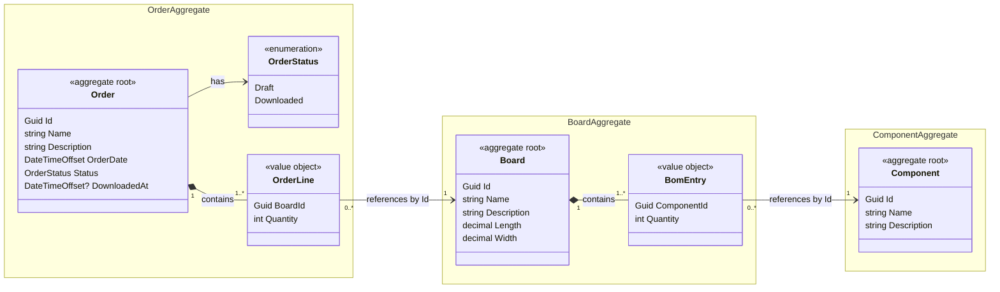

# Domain Model

This document describes the business concepts of the application, their relationships and the rules that apply to them. The requirements it is based on are summarized in [requirements.md](requirements.md).

The model follows **domain-driven design (DDD)**. It defines a ubiquitous language shared by documentation and code, groups the concepts into aggregates, and states which rules each aggregate protects.

Where the original challenge is ambiguous, the model records the chosen interpretation explicitly. Additional rules that are not required by the challenge are identified as design decisions rather than as requirements.

## Ubiquitous language

The terms below are used with exactly these meanings in the documentation, in conversations about the system and in the code. Types in the code carry the same names, for example `Order`, `OrderLine`, `Board`, `BomEntry` and `Component`.

### Domain terms

| Term | Meaning |
|---|---|
| Component | A part type in the component library, for example a 10 kΩ resistor in an 0402 package. A component stands for any number of identical physical parts, not for a single part. |
| Component library | The set of all components known to the system. |
| Board | A printed circuit board design (a board type) together with its bill of materials. A board stands for a reusable design, not for a single produced board. |
| Board dimensions | The length and width of a board, in millimetres. |
| Bill of materials | The list of components mounted on a board, each with its number of placements per board. |
| BOM entry | One component in a board's bill of materials, with the number of placements of that component per board. |
| Placement | One component mounted at one position on a board. The quantity of a BOM entry counts placements. |
| Master data | Components and boards: reusable data that describes what can be built. Master data is maintained independently of production orders. |
| Order | A production order: a production job that states which boards to build and how many of each. "Order" always means a production order, never a customer order. |
| Order line | One board in an order, with the number of boards to produce. |
| Order date | The point in time at which the order was issued, stored with its offset from UTC. |
| Order status | The lifecycle state of an order: *draft* while it is being prepared and can be edited, *downloaded* once an SMT line has accepted it. |
| SMT line | A production line that assembles boards using surface-mount technology. In this application the line is simulated. |
| Order download | Handing an order over to an SMT line for production. |
| Download payload | The data sent to the SMT line during an order download: the order, the boards it references and the total component demand. Its format is versioned and independent of the internal domain model. |
| Download result | The SMT line's answer to an order download: accepted, or rejected with the reasons. |
| Total component demand | For one order, the total number of placements required per component across all ordered boards. |

### Abbreviations

| Abbreviation | Meaning |
|---|---|
| BOM | Bill of materials |
| DDD | Domain-driven design |
| ERP | Enterprise resource planning (business system for customer orders, inventory and purchasing; outside this application) |
| PCB | Printed circuit board |
| SMT | Surface-mount technology |

## Bounded context

The application forms a single bounded context: **production order management**. Its language is the one defined above.

Neighbouring systems have their own models and their own meaning of shared words. In an ERP system, for example, "order" usually means a customer order, and on the SMT line a "board" is a physical board with a serial number. Such meanings are deliberately not part of this context.

The relationships to the neighbouring contexts are:

| Neighbour | Relationship | Notes |
|---|---|---|
| ERP | Upstream, not integrated | Customer orders and inventory are out of scope. Production orders are created in this application. |
| SMT line | Downstream | Receives orders through the download payload. |

Toward the SMT line, this context offers its data in a **published language**: the download payload is a documented, versioned format that is mapped from the domain model rather than being the domain model itself. The domain model can therefore change, for example by gaining a new property on `Board`, without breaking the line, and the line's own model does not leak into this context. When downstream applications are developed by other teams and released on their own schedules, this separation is what allows a feature to be rolled out one application at a time.

## Master data and production orders

The model distinguishes between two kinds of data:

- **Master data** describes *what can be built*: the components in the component library and the boards with their bills of materials.
- **Orders** describe *what is to be built*. An order is a production job, for example "build 500 controller boards and 200 sensor boards", which can be downloaded to an SMT line.

Master data is maintained independently of production. A component can exist in the library before any board uses it, and a board can exist before anyone orders it. Individual physical parts and produced boards (serial numbers, traceability) are out of scope.

## Aggregates

The diagram uses UML notation. A filled diamond marks composition: an object is part of its aggregate and is created and deleted with it. An arrow marks a reference to another aggregate by identifier.

| Aggregate | Aggregate root | Contains | References | Represents in the requirements |
|---|---|---|---|---|
| Order | `Order` | `OrderLine` value objects, `OrderStatus` | Boards, by `BoardId` | Order; Order–Board relationship |
| Board | `Board` | `BomEntry` value objects | Components, by `ComponentId` | Board; Board–Component relationship |
| Component | `Component` | (nothing) | (nothing) | Component |

An aggregate is a consistency boundary: everything inside it is loaded, changed and saved together, and its rules hold after every change. The design follows the usual DDD conventions:

- **Changes go through the aggregate root.** Order lines are added, changed and removed only through their `Order`, and BOM entries only through their `Board`. The root enforces the rules of its aggregate, such as "at least one order line" or "each board at most once per order".
- **Order lines and BOM entries are value objects.** They have no identity of their own and are defined entirely by their values. They are immutable: changing a quantity replaces the value object with a new one.
- **Aggregates reference each other by identifier only.** An order line holds a `BoardId`, not a `Board` object. Each aggregate can therefore be loaded and changed independently, and serialization never produces cyclic object graphs.
- **One repository per aggregate root.** The application has repositories for `Order`, `Board` and `Component`, but none for `OrderLine` or `BomEntry`, because those are always loaded and saved with their aggregate.

The three entities from the requirements map one-to-one onto the three aggregate roots. The two many-to-many relationships from the requirements become value objects inside the aggregate that owns the relationship. In a relational database, order lines and BOM entries are stored as join-table rows with foreign keys to both sides; this is a persistence detail and does not change the domain model.

## Domain service: total component demand

Calculating the total component demand needs an order and all boards it references, so the calculation spans several aggregates. It therefore does not belong to a single aggregate but to a stateless **domain service**. The calculation is described in [Order download](#order-download).

## Quantity

The original requirements assign **Quantity** to `Component` but do not define what that quantity represents.

### BOM quantity: chosen interpretation

For this application, `Quantity` is interpreted as the number of placements of a component on a particular board.

That value belongs to the **Board–Component relationship**, because the same component can be used in different quantities on different boards. It is therefore stored on `BomEntry`.

An alternative interpretation would be a stock or inventory quantity on `Component`. That interpretation was not chosen because inventory management is outside the scope of the challenge.

Note that this moves an attribute from `Component` to the relationship instead of extending the entity. The challenge explicitly permits adding properties, but not relocating listed ones, so this is a deliberate deviation from the attribute list in the challenge rather than a pure extension.

### Order quantity: added relationship data

The requirements specify that an order contains one or more boards but do not state how many units of each board should be produced.

A production order is not very useful without that information, so each `OrderLine` carries the number of boards to produce. This extends the Order–Board relationship with additional data, which is consistent with the requirements' explicit permission to add properties needed to represent relationships.

## Rules

Rules inside one aggregate are enforced by its aggregate root. Rules that span several aggregates, such as restricted deletion, are enforced by the application services, which check the other aggregates through their repositories.

### Cardinality

An order contains at least one order line, and a board contains at least one BOM entry: an order without boards has nothing to produce, and a board without components would represent an empty PCB.

In the other direction, a board does not need to appear in an order, and a component does not need to be placed on a board. This allows master data to be created before it is used.

This is a deliberate relaxation of the original requirements, which describe a board as appearing in one or more orders and a component as placed on one or more boards. Read strictly, every board would have to be ordered and every component placed at the moment it is created, which would make it impossible to build up master data ahead of production.

A natural creation sequence is therefore:

1. components
2. boards and their BOMs
3. production orders

### Quantities

All quantities are positive integers.

Within one order, a board appears at most once. Within one BOM, a component appears at most once. Changing a quantity replaces the existing order line or BOM entry instead of adding a second one for the same board or component.

### Identity

Every aggregate root has a technical `Guid Id`, and references between aggregates use that identifier.

`Name` remains a descriptive/business-facing field as required by the challenge. The challenge does not define names as globally unique identifiers, part numbers, revision numbers, or order numbers, so no such semantics are required by the domain model.

If the implementation later introduces stronger business identifiers such as `PartNumber`, `BoardRevision`, or `OrderNumber`, they should be modelled explicitly rather than inferred from `Name`.

Renaming an entity does not break references because references use the technical identifier.

### Deletion: chosen integrity policy

The challenge requires removal operations but does not define referential-integrity behavior.

This implementation chooses **restrict deletion**:

- a component that is referenced by a BOM cannot be deleted;
- a board that is referenced by an order cannot be deleted.

Instead of silently cascading changes into existing BOMs or production orders, the application reports where the entity is still used.

The same rule applies to batch removal: a batch is validated as a whole, and if any entity in it is still referenced, the entire batch is rejected and all violations are reported.

Because this rule spans aggregates, it is enforced by the application services, not by an aggregate root.

A downloaded order cannot be removed either, for the reason described in [Order status](#order-status).

This is an implementation policy, not a requirement imposed by the original challenge.

### Order status

Every order starts as a **draft**. It becomes **downloaded** when an SMT line accepts it, and the time of acceptance is recorded.

A downloaded order can no longer be edited or removed. Changing a production job that is already on the line is risky in practice: the line would produce something other than what the system shows. The `Order` aggregate root enforces the edit rule itself; removal is not an operation of the aggregate, so the application services enforce the removal rule.

A downloaded order can be downloaded again, for example when the line needs the job a second time. A rejected or failed download leaves the order a draft, so it can be corrected and downloaded again.

This is a design decision, not a requirement of the challenge.

### Order date

The order date is a point in time with its offset from UTC (`DateTimeOffset`), as is the time of download. This keeps timestamps unambiguous across time zones.

### Dimensions

Board length and width are interpreted as millimetres.

## Order download

The required "download of an order" is modelled as sending a download payload to a simulated SMT line.

The minimum payload contains the order and the referenced boards. As a small domain enhancement, the download also contains the **total component demand** for that order, calculated by the domain service described above.

The line answers with a download result. Only an accepted download changes the order status to downloaded (see [Order status](#order-status)).

Whether a line can produce a board, for example because of the board's dimensions, is a capability of that line and not a rule of this domain. A board of any positive size is valid master data; the line decides whether it can handle it. The checks of the simulated line are described in the [architecture](architecture.md#simulated-smt-line).

For each component, calculate its required quantity separately:

`total required quantity for this component = sum(number of boards ordered × quantity of this component on that board)`

Only BOM entries that reference the same `ComponentId` are summed together.

For example, suppose an order contains 500 controller boards and 200 sensor boards:

- each controller board uses 12 × `RES-10K-0402`;
- each sensor board uses 3 × `RES-10K-0402`.

Then the total required quantity of that resistor is:

`500 × 12 + 200 × 3 = 6,600`

A different component, such as `CAP-100N-0402`, is calculated separately and is never added to the resistor total.

This calculation is not explicitly required by the challenge, but it makes the simulated production-line handoff meaningful and provides a representative piece of domain logic that can be covered by unit tests.