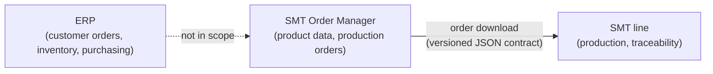

# Requirements

This project was built as a technical exercise. This document summarizes the original requirements, records how ambiguous points are interpreted, documents additional design decisions, and tracks implementation status.

## Context

The task is framed as a sprint in an agile team: develop a robust, platform-independent C# application for managing orders in a surface-mount technology (SMT) manufacturing environment, and present the result to the team at the end of the sprint, including an outline of the modelled classes and the architecture.

### Product context

SMT shop-floor software is typically sold together with the production equipment and delivered as a suite of applications, each covering one workflow: programming, production planning, material logistics, setup preparation, line operations, monitoring, process optimization and system integration. The applications are usually developed by separate teams, but they exchange data along the production flow, from product data and production orders down to the machines on the line.

This application is modelled as one module in such a suite. It covers product data and production orders and hands orders over to the line, so it sits at the start of that flow.

In a suite like this, a new feature often has to travel through several applications before it reaches production. Adding a board property, for example, can affect product data, planning, setup preparation and the line itself. Coordinating such a change is a planning, timing and testing challenge as much as a technical one. The technical part of that challenge shapes several decisions in this project: the order download is treated as an explicit, versioned interface contract (see [design policies](#design-policies-and-extensions)), and the domain model is kept separate from the data exchanged with other applications (see the [bounded context](domain-model.md#bounded-context)).

## System scope

The application is an **order management system for SMT production**. It works at the planning level, between business systems such as an enterprise resource planning (ERP) system and the production line:

**In scope**

- Product data: the component library and board designs with their bill of materials
- Production orders: which boards to build and how many of each
- Order download: handing a production order over to a simulated SMT line

**Out of scope**

- Business processes of an ERP: customer orders, inventory, purchasing, costing
- Production scheduling and line capacity planning
- Machine programming, such as placement positions and feeder setups
- Production execution and traceability of individual produced boards

The boundary follows the chosen interpretation of the brief: boards and components are treated as reusable master data, while orders represent production jobs. Physical boards with their own serial numbers come into existence on the production side and are outside this exercise. See the [domain model](domain-model.md) for details.

## Quality goals

| Priority | Quality goal | Motivation |
|---|---|---|
| 1 | Interoperability | Orders are handed over to other applications, so the exchanged data must be well defined and stable. |
| 2 | Evolvability | Features travel through several applications that are released on different schedules. Changes must be possible without breaking consumers. |
| 3 | Testability | Domain rules and the download contract must be verifiable automatically, independent of storage and of the line. |
| 4 | Portability | The application must run on every platform supported by .NET. |

## Domain

| Entity | Attributes from challenge | Modelled as |
|---|---|---|
| Order | Name, Description, Order Date | `Order.Name`, `Order.Description`, `Order.OrderDate` |
| Board | Name, Description, Length, Width | `Board.Name`, `Board.Description`, `Board.Length`, `Board.Width` (millimetres) |
| Component | Name, Description, Quantity | `Component.Name`, `Component.Description`; Quantity → `BomEntry.Quantity` (see [BOM quantity](#interpretations)) |

- An order includes one or more boards; a board can be produced in one or more orders.
- A board contains one or more components; a component can be placed on one or more boards.
- Entities may be extended with additional properties such as IDs, foreign keys and reference lists to represent the relationships.

## Phase 1: core requirements

- [ ] Create, edit, search and remove one or more orders, boards and components (see [batch operations](#interpretations))
- [ ] Download an order to a simulated production line
- [ ] Serialize data to JSON for interoperability (order-download payload)
- [ ] Persist data to JSON files using `System.Text.Json`
- [ ] Data persists across application restarts
- [ ] Log relevant actions and errors using a commonly adopted logging framework
- [ ] Apply OOP principles (e.g. SOLID, DRY) and standard design patterns (including the DDD patterns aggregate, value object, repository and domain service)
- [ ] Unit test for at least one representative method
- [ ] Platform-independent application
- [ ] Outline of the modelled classes and architecture for the sprint review

## Phase 2: optional extensions

### Version control

- [x] Project hosted in a free version control system
- [ ] Repository accessible for review (public or restricted access)
- [ ] All code changes committed to the remote repository

### CI/CD

- [ ] Pipeline builds the application automatically on each commit
- [ ] Pipeline deploys the application to a free-tier cloud provider

### Web interface

- [ ] Web UI accessible via login
- [ ] Web UI communicates with a backend Web API
- [ ] CRUD for orders, boards and components in the web UI
- [ ] Authentication (custom login or free identity provider)

### Persistence upgrade

Phase 1 already satisfies the challenge's persistence requirement by storing JSON files across application restarts.

In Phase 2, **SQLite** becomes the default persistence. The JSON-file repositories from Phase 1 remain available as an alternative implementation, selected via configuration. The domain and application layers stay independent of the storage technology.

- [ ] Add SQLite persistence as the default storage
- [ ] Implement SQLite repositories behind the same persistence abstractions used by Phase 1
- [ ] Keep the JSON-file repositories selectable via configuration
- [ ] Preserve JSON serialization for interoperability: order-download payload and Web API request/response bodies

### Containerization

SQLite is an embedded database without a server process. "Containerizing the database" therefore means running SQLite inside the API container and storing the database file on a persistent Docker volume, rather than running a separate database container.

- [ ] Entire solution containerized (API with embedded SQLite, frontend)
- [ ] Database file stored on a persistent volume
- [ ] Dockerfile and docker-compose.yml provided
- [ ] Containers runnable both locally and in the cloud

## Interpretations and design decisions

The challenge is intentionally brief and leaves room for interpretation. The implementation therefore separates three categories:

1. **Explicit requirements:** stated directly in the challenge.
2. **Interpretations:** choices made where the challenge is ambiguous.
3. **Design policies/extensions:** additional decisions that make the application robust or more representative of a real SMT system.

The detailed reasoning is described in the [domain model](domain-model.md).

### Interpretations

- **Master data.** Boards and components are interpreted as reusable master data (board designs and component types), not physical produced items.
- **BOM quantity.** The `Quantity` listed for `Component` is interpreted as the number of component placements on a particular board and is therefore modelled on the Board–Component relationship (`BomEntry`). This moves an attribute rather than extending the entity, and is therefore a deliberate deviation from the attribute list in the challenge. Inventory quantity was considered but rejected as outside scope.
- **Order quantity.** The Order–Board relationship (`OrderLine`) carries the number of boards to produce because the challenge does not otherwise specify production quantity.
- **Minimum cardinality.** An order contains at least one board and a board at least one component. In the reverse direction, the original requirements describe a board as appearing in one or more orders and a component as placed on one or more boards. The model deliberately relaxes this to zero or more, so that boards and components can exist before they are used.
- **Batch operations ("one or more").** Create, edit and remove operations accept one or more entities per call. Search returns zero or more matching entities.
- **JSON interoperability.** In Phase 1, JSON is used both for persistence and for the order-download payload sent to the simulated line. In Phase 2, the order-download payload and the Web API request/response bodies remain JSON, independent of the storage technology.
- **Dimensions.** Board length and width are interpreted as millimetres.

### Design policies and extensions

- **Identity.** Main entities use GUIDs as technical identifiers. `Name` remains a descriptive/business-facing property; no additional uniqueness semantics are inferred from the challenge.
- **Domain-driven design.** The domain is modelled with DDD: a ubiquitous language, a single bounded context and explicit aggregates. See the [domain model](domain-model.md).
- **Aggregates.** `Order`, `Board` and `Component` are aggregate roots. `OrderLine` and `BomEntry` are value objects inside the `Order` and `Board` aggregates and have no independent lifecycle. Aggregates reference each other by identifier only, and each aggregate root has its own repository.
- **Deletion.** Referenced boards and components cannot be deleted; the application reports where they are still used. This is a chosen referential-integrity policy.
- **Batch atomicity.** A batch operation is validated as a whole. If any entity in the batch violates a rule, for example a referenced component in a batch removal, the entire batch is rejected and the violations are reported.
- **Versioned download contract.** The order-download payload is a published interface, not a serialized copy of the domain model. It carries an explicit schema version. Within a version, changes are additive only, and consumers are expected to ignore fields they do not know. Breaking changes require a new schema version. Contract tests pin the payload format, so an unintended change fails the build.
- **Contract ownership.** The application layer maps the domain model to the download payload and serializes it to JSON, so the contract and its JSON representation are owned in one place. The production-line abstraction receives the serialized JSON, not the payload objects. See the [integration contract](architecture.md#integration-contract).
- **Simulated line as independent consumer.** The simulated SMT line parses the JSON with its own reader types, checks the schema version and rejects unsupported versions with a reason, ignores unknown fields, and writes each accepted job to an inbox directory. It does not simulate production itself. See [Simulated SMT line](architecture.md#simulated-smt-line).
- **Line dimension limit.** The simulated line has a configurable maximum board length and width and rejects orders containing boards that exceed it, listing each affected board. This is a capability of the line, not a domain rule, and the configured values do not describe any specific machine.
- **Download outcome.** A download returns an explicit result: accepted, or rejected with reasons. An unreachable line is reported as a technical failure. Both outcomes are logged.
- **Order status.** An order is a draft until a line accepts its download; then it becomes downloaded. Downloaded orders cannot be edited or removed but can be downloaded again. A rejected or failed download leaves the order a draft. See [Order status](domain-model.md#order-status).
- **Timestamps.** The order date and the time of download are stored as `DateTimeOffset`, so they stay unambiguous across time zones.
- **Order download enhancement.** The simulated production payload may include calculated total component demand. This is an extension, not an explicit challenge requirement.
- **Persistence evolution.** Phase 1 uses JSON files. Phase 2 adds SQLite repositories as the default, keeps JSON-file repositories selectable, and does not change the domain model.
- **Test projects.** Domain, application and infrastructure each have their own test project, so tests follow the same dependency rule as the code. The contract test of the download payload lives next to the contract in the application tests. See [project dependencies](architecture.md#project-dependencies).